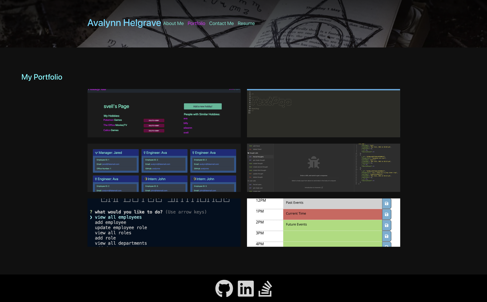

# Avalynn-Helgrave-Portfolio

## Description

This program is desinged to be a portfolio website for Avalynn C. Helgrave

## Table of Contents

- [Website](#website)
- [Usage](#usage)
- [Contributing](#contributing)
- [License](#license)
- [Questions](#questions)

## Website

# [Deployed Heroku Application](https://avalynnw.github.io/Avalynn-Helgrave-Portfolio/#portfolio)

## Contributing

Collaborators: Avalynn Helgrave, https://github.com/avalynnw

Third-Party Assets: Modules: express, webpack, babel

## License

#### The Unlicense

http://unlicense.org/

## Questions

https://github.com/avalynnw

 Contact me at: avalynnjudge@gmail.com
